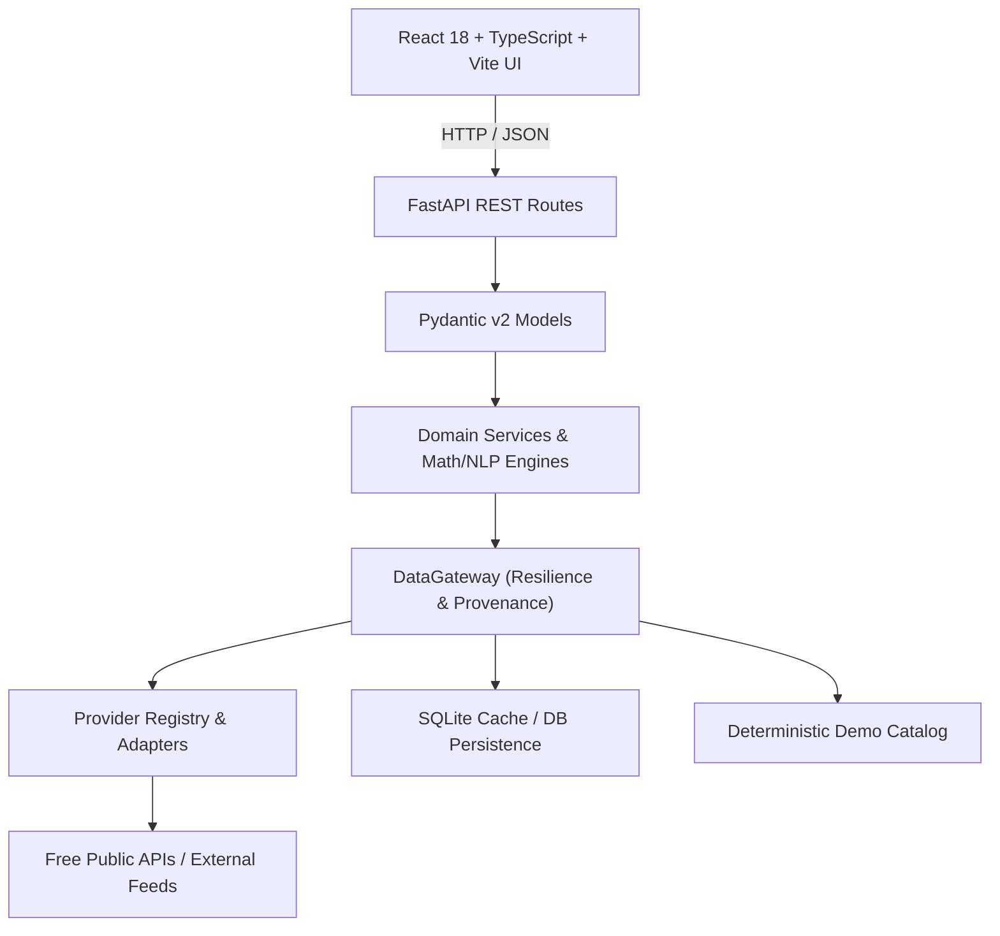

# MarketPulse AI — Multi-Factor Financial & Geopolitical Intelligence Platform

[](./backend)
[](./frontend)
[](./backend)
[](./LICENSE)

**MarketPulse AI** is an advanced, student-built financial and geopolitical intelligence platform designed for institutional-grade market surveillance, macroeconomic tracking, explainable NLP sentiment analysis, and evidence-grounded AI research synthesis.

The system is built from the ground up to operate reliably on **free-first public data feeds and high-fidelity local deterministic catalogs**, featuring an automated resilient DataGateway with zero paid API lock-in.

---

## 🌟 Key Features

1. **📈 Indian Equities & Index Surveillance**:
   - Real-time quote retrieval, session movers, volume tracking, and sector tagging.
   - Interactive multi-timeframe charts (`1D`, `5D`, `1M`, `3M`, `6M`, `1Y`) powered by Recharts.
   - Mathematical technical indicator engine: **SMA (20, 50)**, **EMA (20)**, **RSI (14)**, **MACD (12/26/9)**, **Annualized Realized Volatility**, **Max Drawdown**, and **Period Returns**.

2. **🏛️ Macroeconomic Intelligence Hub**:
   - Continuous tracking of 7 systemic indicators: CPI Inflation, RBI Policy Repo Rate, GDP Growth, Unemployment Rate, Brent Crude Oil, Gold, and USD/INR Currency Pair.
   - Historical multi-period series tracking and comparison.

3. **📰 News & Corporate Announcements**:
   - Real-time categorised intelligence streams (`MARKET`, `COMPANY`, `MACRO`, `GEOPOLITICS`, `COMMODITIES`, `TECHNOLOGY`, `REGULATORY`).
   - Content hashing and deduplication pipeline.
   - Official corporate releases, regulatory filings, and central bank calendars.

4. **🧠 Explainable Sentiment NLP Engine**:
   - Pure-Python domain-tuned financial lexicon analyzer with negation logic, intensifier weighting, and token density confidence.
   - Aggregate market sentiment gauges, sector-by-sector heatmaps, and 7D/30D sentiment trajectory tracking.
   - Interactive Text Sentiment Sandbox for live headline scoring.

5. **🌍 Geopolitical Risk Intelligence**:
   - Conflict, sanction, tariff, and maritime route risk monitoring.
   - Normalized severity scoring (0–100), regional risk aggregations, and asset/sector exposure cross-mapping.

6. **🤖 Grounded AI Intelligence Analyst**:
   - Contextual multi-factor synthesizer uniting market data, macro trends, news narratives, and geopolitical tensions into evidence-backed intelligence briefs.
   - Explicit uncertainty boundaries and citations to empirical data points.

7. **⚡ Risk & Scenario Lab**:
   - Quantitative composite market risk score (0–100) and automated market regime classification (`TRENDING_UP`, `TRENDING_DOWN`, `HIGH_VOLATILITY`, `RANGE_BOUND`).
   - Macroeconomic stress simulator (Crude Oil shock, interest rate hike, geopolitical disruptions) with sector-specific price elasticity models.
   - Pairwise Pearson asset correlation matrix.

8. **🔍 Unified Global Search & Workspace**:
   - Instant search across all 6 intelligence dimensions with keyboard shortcut (`/` or `Ctrl+K`).
   - Personal tracked Watchlist, saved AI research notes, and platform preferences.

9. **🛡️ Data Provenance & Resilient Gateway**:
   - Layered fallback: `Primary Live Provider → Validation & Normalization → SQLite Cache → Demo Catalog`.
   - Transparent provenance tagging (`LIVE`, `CACHED`, `DEMO DATA`) across every API response and UI component.
   - Zero hardcoded credentials, zero secret leakage in logs or error responses.

---

## 🏗️ Layered Architecture



---

## 🚀 Quick Start Guide

### Prerequisites
- Python 3.11+ / Python 3.14+
- Node.js 18+ & npm

### 1. Backend Setup

```bash
# Navigate to backend directory
cd backend

# Create & activate virtual environment
python -m venv .venv
# On Windows:
.\.venv\Scripts\Activate.ps1
# On Linux/macOS:
source .venv/bin/activate

# Install dependencies
pip install -r requirements.txt

# Run full test suite (101 passing tests)
pytest -v

# Start FastAPI backend server
uvicorn app.main:app --reload --port 8000
```
Backend API will be accessible at: `http://localhost:8000` (Swagger UI: `http://localhost:8000/docs`).

### 2. Frontend Setup

```bash
# Navigate to frontend directory
cd frontend

# Install packages
npm install

# Start Vite development server
npm run dev

# Or build production distribution
npm run build
```
Frontend Web Dashboard will be accessible at: `http://localhost:3000` (or `http://localhost:5173`).

---

## 📡 API Endpoint Overview

| Endpoint | Method | Description |
| :--- | :---: | :--- |
| `/api/health` | `GET` | Application health and timestamp |
| `/api/system/status` | `GET` | Backend, database latency, and provider telemetry |
| `/api/system/providers` | `GET` | List of registered adapters and active modes |
| `/api/markets/overview` | `GET` | Indices, gainers, decliners, active equities |
| `/api/markets/quote/{symbol}` | `GET` | Real-time quote with sector and provenance |
| `/api/markets/history/{symbol}` | `GET` | Multi-timeframe OHLCV candlestick series |
| `/api/markets/indicators/{symbol}` | `GET` | Technical indicators (SMA, EMA, RSI, MACD, Volatility) |
| `/api/macro` | `GET` | All 7 macroeconomic indicators |
| `/api/macro/{indicator}` | `GET` | Detailed historical series for single indicator |
| `/api/news` | `GET` | News stream with category, search, and entity filters |
| `/api/announcements` | `GET` | Corporate and regulatory announcement feed |
| `/api/sentiment` | `GET` | Market-wide sentiment score and sector breakdown |
| `/api/sentiment/trends` | `GET` | 7D / 30D historical sentiment trajectories |
| `/api/sentiment/analyze` | `POST` | Live custom text sentiment NLP analyzer |
| `/api/geopolitics` | `GET` | Geopolitical event feed with severity ratings |
| `/api/geopolitics/regions` | `GET` | Regional risk aggregations and event counts |
| `/api/ai/insights` | `GET` | Pre-compiled multi-factor intelligence digest |
| `/api/ai/research` | `POST` | Grounded contextual natural language AI query |
| `/api/risk/overview` | `GET` | Composite market risk score and regime label |
| `/api/risk/scenario` | `POST` | Macroeconomic and geopolitical stress simulator |
| `/api/risk/correlation` | `GET` | Pairwise asset Pearson correlation matrix |
| `/api/alerts` | `GET` | Rule-based active threshold alerts |
| `/api/search` | `GET` | Unified global search across all 6 domains |
| `/api/user/watchlist` | `GET/POST` | User tracked securities watchlist management |
| `/api/user/research` | `GET/POST` | Saved AI research notes repository |
| `/api/user/preferences` | `GET/PUT` | Platform UI and notification preferences |

---

## ⚖️ Academic & Educational Disclaimer

> **IMPORTANT**: MarketPulse AI is an experimental educational and research platform created exclusively for technical portfolio demonstration.
> 
> - **NOT Investment Advice**: MarketPulse AI is **NOT** a registered investment adviser (SEBI, SEC, or others). It does not provide trading recommendations, buy/sell signals, or guaranteed profit assurances.
> - **Transparent Provenance**: All synthetic demo data is explicitly flagged with `DEMO DATA` badges. Live data feeds and cached responses are clearly labeled.
> - **AI Uncertainty**: All AI and mathematical outputs state explicit uncertainty boundaries, model disclaimers, and grounded empirical citations.
